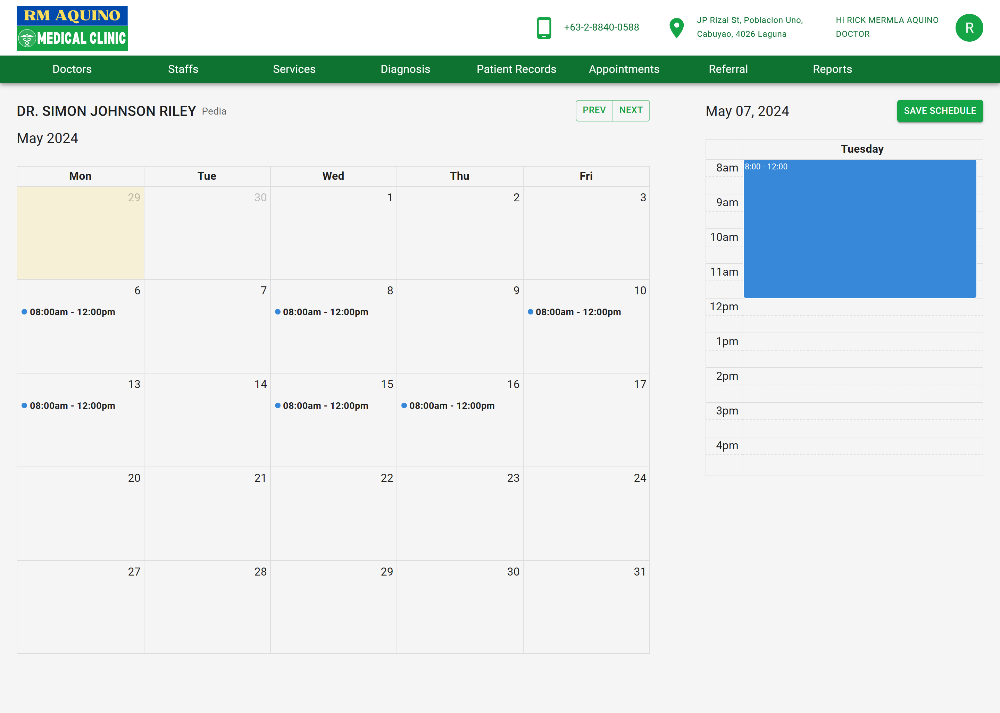
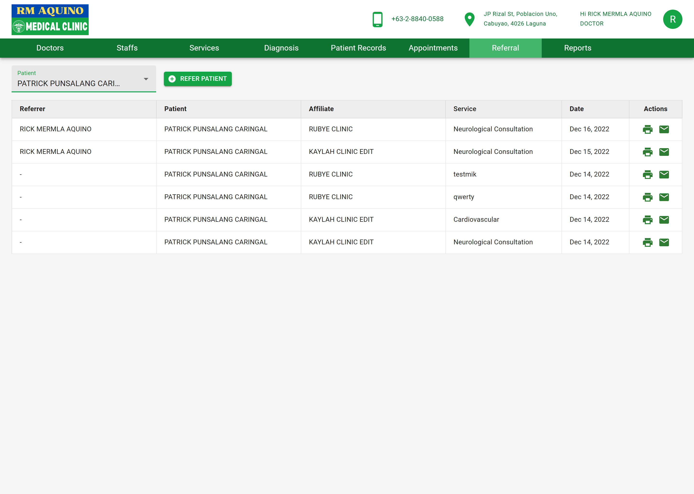
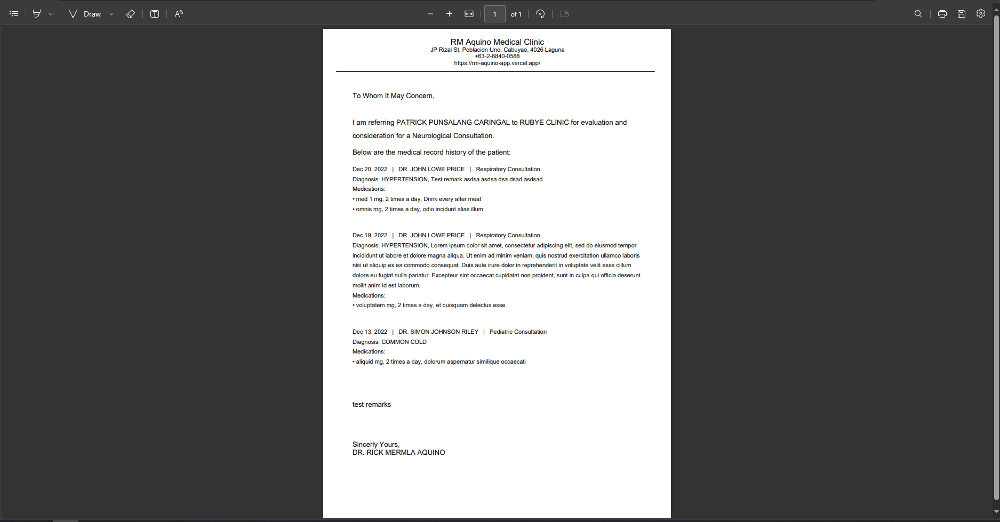
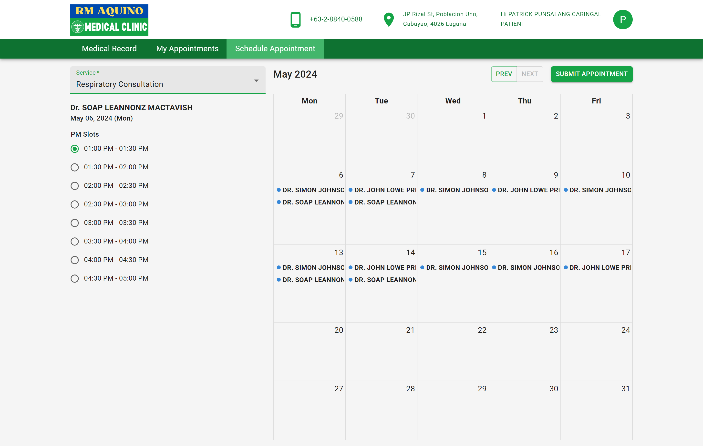
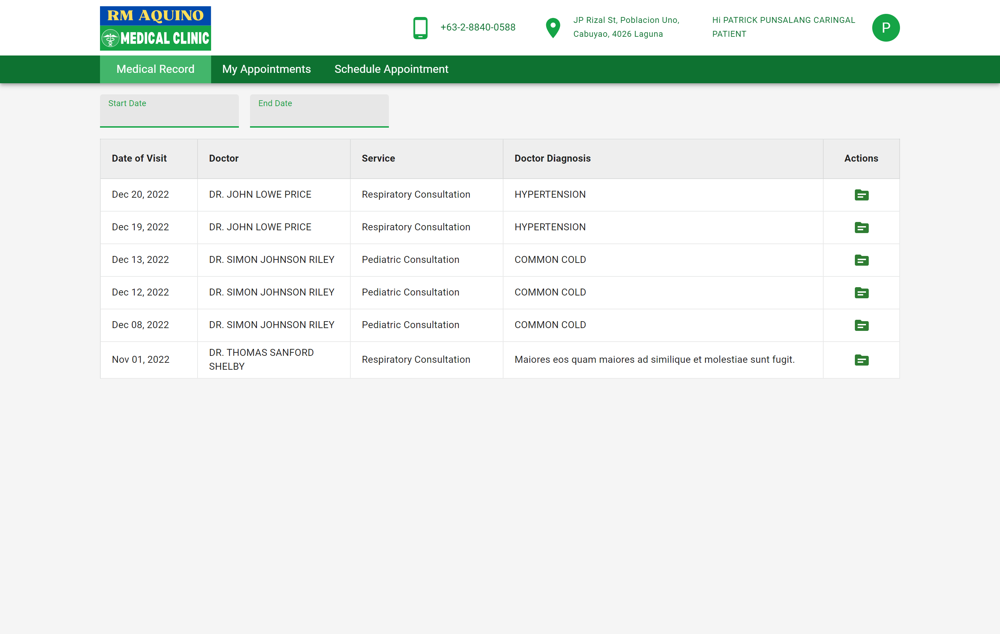
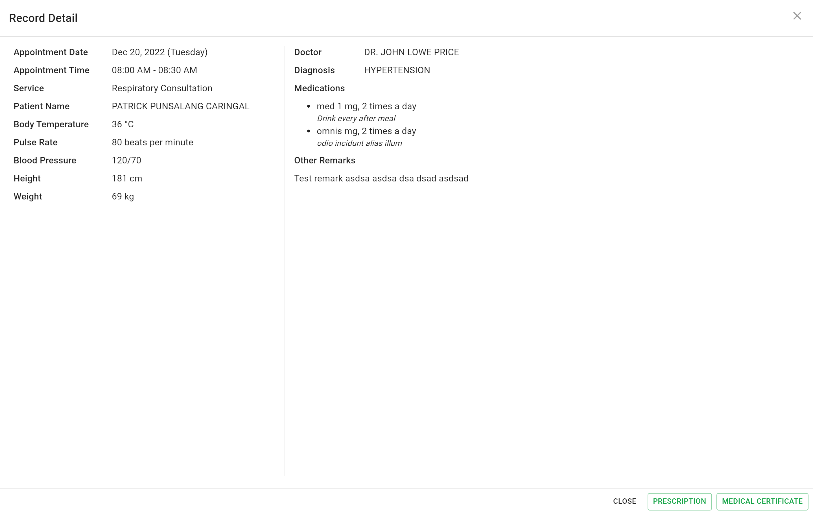

## About The Project

A web application that provides online appointment booking feature that displays available time slots based on the clinic doctors schedule, enabling patients to schedule appointments conveniently online. Offers management of patient's electronic health record for efficient and organized consultation. Incorporate feature for generating referral letters or documents for affiliate healthcare providers.

### Built With

- ![React][React-badge]
- ![NextJS][NextJS-badge]
- ![JavaScript][JavaScript-badge]
- ![NodeJS][NodeJS-badge]
- ![Expressjs][Expressjs-badge]
- ![Firebase][Firebase-badge]
- ![SASS][SASS-badge]
- ![MUI][MUI-badge]

## Features

#### Doctor / Staff account

- View their patient medical records, including medical history, and diagnosis, ensuring informed healthcare decisions.
- Manage doctors, staff members, and available services, ensuring optimal clinic operations and resource allocation.
- Doctor Diagnosis feature to facilitate doctors in diagnosing patients and prescribing appropriate treatments.
- Doctor Scheduling functionality enabling doctors to manage their availability and appointment schedules, empowering them to efficiently organize and optimize their patient consultations.
- Generation of referral letters for patients requiring treatment at affiliate clinics, simplifying the referral process.
- Generation of electronic prescriptions and medical certificates.
- Generation of detailed reports, including appointments per day, patients seen per day, and monthly or yearly patient statistics.

#### Patient account

- Patients can securely view their medical records and diagnosis from past visits, providing valuable insight into their health history and treatment plans.
- Enable patients to easily schedule appointments online, selecting convenient time slots based on availability.
- Ability to view patient's own appointments, ensuring they stay informed about their scheduled healthcare visits.
- Printing of essential documents such as prescriptions, medical certificates, and referrals directly from their account.

## Screenshots

### Doctor / Staff account

- #### Doctor Scheduling functionality

  

- #### Generation of Referral letter to

  

- #### Sample of Generated Referral letter
  

### Patient account

- #### Schedule an appointment

  

- #### Access past medical records

  

- #### Medical record detail
  

<!-- MARKDOWN LINKS & IMAGES -->
<!-- https://www.markdownguide.org/basic-syntax/#reference-style-links -->

[React-Query-badge]: https://img.shields.io/badge/-React%20Query-FF4154?style=for-the-badge&logo=react%20query&logoColor=white
[TypeScript-badge]: https://img.shields.io/badge/typescript-%23007ACC.svg?style=for-the-badge&logo=typescript&logoColor=white
[React-badge]: https://img.shields.io/badge/react-%2320232a.svg?style=for-the-badge&logo=react&logoColor=%2361DAFB
[Chakra-badge]: https://img.shields.io/badge/chakra-%234ED1C5.svg?style=for-the-badge&logo=chakraui&logoColor=white
[CSS3-badge]: https://img.shields.io/badge/css3-%231572B6.svg?style=for-the-badge&logo=css3&logoColor=white
[SASS-badge]: https://img.shields.io/badge/SASS-hotpink.svg?style=for-the-badge&logo=SASS&logoColor=white
[Firebase-badge]: https://img.shields.io/badge/firebase-a08021?style=for-the-badge&logo=firebase&logoColor
[Bootstrap-badge]: https://img.shields.io/badge/bootstrap-%238511FA.svg?style=for-the-badge&logo=bootstrap&logoColor=white
[JavaScript-badge]: https://img.shields.io/badge/javascript-%23323330.svg?style=for-the-badge&logo=javascript&logoColor=%23F7DF1E
[NextJS-badge]: https://img.shields.io/badge/Next-black?style=for-the-badge&logo=next.js&logoColor=white
[NodeJS-badge]: https://img.shields.io/badge/node.js-6DA55F?style=for-the-badge&logo=node.js&logoColor=white
[MUI-badge]: https://img.shields.io/badge/MUI-%230081CB.svg?style=for-the-badge&logo=mui&logoColor=white
[Expressjs-badge]: https://img.shields.io/badge/express.js-%23404d59.svg?style=for-the-badge&logo=express&logoColor=%2361DAFB
